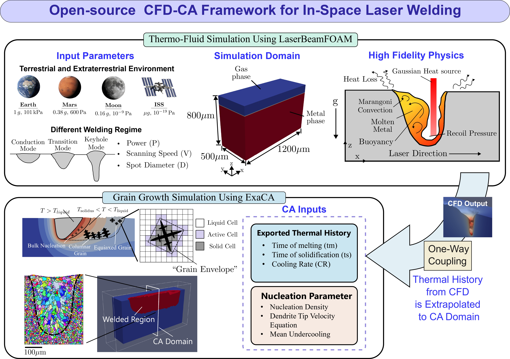
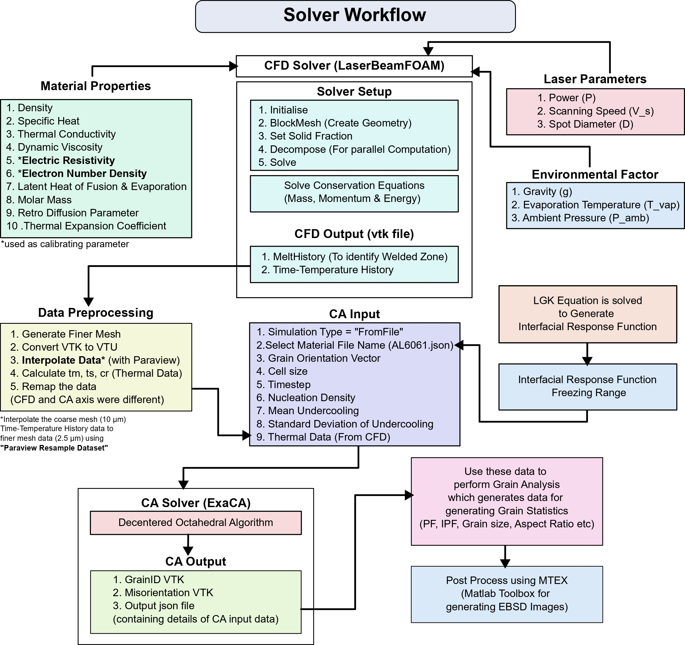

# Process–Microstructure Coupling in Reduced Gravity Laser Welding

Open-source multiphysics simulation framework for CFD-CA simulation of in-space laser welding.

**Paper:** [arxiv.org/abs/2511.15725](https://arxiv.org/abs/2511.15725)





## Authors

**Rakibul Islam Kanak**¹, **Taslima Hossain Sanjana**¹, **Apurba Sarker**², **Sourav Saha**²*

¹ Department of Mechanical Engineering, Bangladesh University of Engineering and Technology (BUET), Dhaka, Bangladesh  
² Kevin T. Crofton Department of Aerospace and Ocean Engineering, Virginia Polytechnic Institute and State University, Blacksburg, VA 24061, USA

*Corresponding author: souravsaha@vt.edu

## Prerequisites

### 1. OpenFOAM 10

**Local Installation:**
```bash
# Follow official Ubuntu installation guide
# https://openfoam.org/download/10-ubuntu/
```

**HPC Cluster:**
- Compile from source: [OpenFOAM 10 Source](https://openfoam.org/download/10-source/)
- Requirements: GCC 13, OpenMPI 5.0.7
- Download OpenMPI: [openmpi-5.0.7.tar.bz2](https://download.open-mpi.org/release/open-mpi/v5.0/openmpi-5.0.7.tar.bz2)

**Build Order:**
1. Load GCC 13
2. Compile OpenMPI 5.0.7
3. Load OpenMPI 5.0.7 + GCC 13
4. Compile OpenFOAM 10

### 2. LaserbeamFoam (Modified)

Modified version of [LaserbeamFoam](https://github.com/laserbeamfoam/LaserbeamFoam) with:
- Temperature-dependent properties
- Modified recoil pressure for variable ambient pressure
- Heat loss terms (radiation, convection)

**Installation:**
```bash
# Load: GCC 13, OpenFOAM 10, OpenMPI 5.0.7
./Allwmake
```

### 3. ExaCA

Follow installation guide: [ExaCA GitHub](https://github.com/LLNL/ExaCA)

### 4. ParaView 5.13

Download from: [paraview.org/download](https://www.paraview.org/download/)

## Running CFD Simulations

### Parametric Study Setup

1. **Configure template path** in script:
```python
TEMPLATE_PATH = "/path/to/your/template/case"
```

2. **Generate example CSV files:**
```bash
python3 script.py --create-examples
```

3. **Run simulations:**
```bash
# Generate cases only
python3 script.py --csv parameters.csv --output my_cases

# Generate and submit to SLURM
python3 script.py --csv parameters.csv --output my_cases --submit
```

### CSV Parameters

**Laser:** `laser_radius`, `laser_e_num_density`, `laser_radius_flavour`, `powder_sim`  
**Phase:** `phase_sigma`, `phase_dsigmadT`, `phase_p_amb`, `phase_Tvap`, `phase_beta_r`  
**Gas:** `gas_nu`, `gas_rho`, `gas_beta`, `gas_poly_kappa`, `gas_poly_cp`  
**Metal:** `metal_elec_resistivity`, `metal_emissivity`, `metal_T_ambient`, `metal_h_convection`  
**Mesh:** `mesh_width`, `mesh_track_length`, `mesh_patching_height`, `mesh_size`  
**Time:** `time_total_time`, `time_scan_speed`, `time_laser_power`, `time_initial_pos`  
**Gravity:** `gravity_y`

### Example CSV

**Minimal:**
```csv
time_laser_power,mesh_size
400,8e-6
500,10e-6
```

**Full parameters:**
```csv
laser_radius,time_laser_power,mesh_size,time_scan_speed
40e-6,400,8e-6,0.8
50e-6,500,10e-6,0.7
```

## Post-Processing for CA Simulation

### Export Thermal History Data

1. **Configure paths** in `generate_ca_file_job.sh`:
```bash
VENV_PATH="$HOME/venv312/bin/activate"
PARAVIEW_PATH="/path/to/ParaView-5.13.3-MPI-Linux-Python3.10-x86_64/bin/pvpython"
```

2. **Select cases to process:**
```bash
SELECTED_CASES=("case_000_cond" "case_001_cond" "case_002_cond")
```

3. **Run VTK pipeline:**
```bash
./generate_ca_file_job.sh
```

**Output:** Thermal history CSV files in `All_results/` folder containing x, y, z coordinates with tm, ts, cr data.

## ExaCA Simulation

### Configuration

Edit `ca_files/Inp_SingleLine.json`:

```json
{
  "MaterialFileName": "/path/to/ExaCA/examples/Materials/Al6061.json",
  "TemperatureFiles": ["/path/to/All_results/output_case_008_remapped.csv"]
}
```

### Execution

```bash
mpiexec -n 1 ExaCA Inp_SingleLine.json
```

**Output:** JSON file, grain ID VTK file, misorientation VTK file

## Grain Analysis

Use output files with ExaCA grain analysis tools:  
[ExaCA Analysis Documentation](https://github.com/LLNL/ExaCA/tree/master/analysis)

## Citation

If you use this framework, please cite:
```
[Citation details from arxiv.org/abs/2511.15725]
```

## Acknowledgments

This framework builds upon the excellent work of:

- **LaserbeamFoam**: Original solver developed by the LaserbeamFoam team  
  Repository: [github.com/laserbeamfoam/LaserbeamFoam](https://github.com/laserbeamfoam/LaserbeamFoam)

- **ExaCA**: Exascale Cellular Automata developed by Lawrence Livermore National Laboratory  
  Repository: [github.com/LLNL/ExaCA](https://github.com/LLNL/ExaCA)  
  Authors: M.J. Rolchigo, J. Coleman, et al.

We gratefully acknowledge their contributions to the open-source community.

## License

This project is licensed under the MIT License - see the [LICENSE](LICENSE) file for details.

```
MIT License

Copyright (c) 2024 Rakibul Islam Kanak, Taslima Hossain Sanjana, Apurba Sarker, Sourav Saha
BUET (Bangladesh) & Virginia Tech (USA)

Permission is hereby granted, free of charge, to any person obtaining a copy
of this software and associated documentation files (the "Software"), to deal
in the Software without restriction, including without limitation the rights
to use, copy, modify, merge, publish, distribute, sublicense, and/or sell
copies of the Software, and to permit persons to whom the Software is
furnished to do so, subject to the following conditions:

The above copyright notice and this permission notice shall be included in all
copies or substantial portions of the Software.

THE SOFTWARE IS PROVIDED "AS IS", WITHOUT WARRANTY OF ANY KIND, EXPRESS OR
IMPLIED, INCLUDING BUT NOT LIMITED TO THE WARRANTIES OF MERCHANTABILITY,
FITNESS FOR A PARTICULAR PURPOSE AND NONINFRINGEMENT. IN NO EVENT SHALL THE
AUTHORS OR COPYRIGHT HOLDERS BE LIABLE FOR ANY CLAIM, DAMAGES OR OTHER
LIABILITY, WHETHER IN AN ACTION OF CONTRACT, TORT OR OTHERWISE, ARISING FROM,
OUT OF OR IN CONNECTION WITH THE SOFTWARE OR THE USE OR OTHER DEALINGS IN THE
SOFTWARE.
```

**Note:** This project integrates multiple open-source components. Please refer to the original licenses of LaserbeamFoam, ExaCA, and OpenFOAM for their respective terms.

## Contact

For questions, issues, or contributions:
- Open an issue on [GitHub Issues](https://github.com/[your-repo]/issues)
- Email: souravsaha@vt.edu (Corresponding Author) or rakibul.buet19@gmail.com